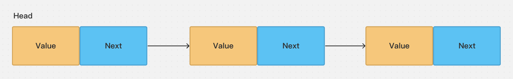
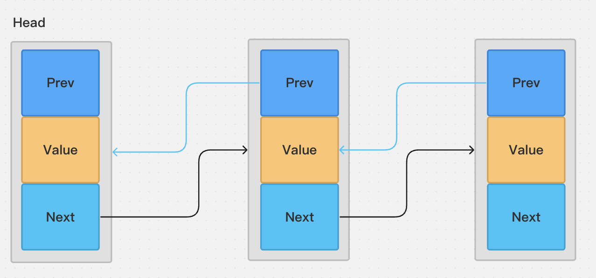
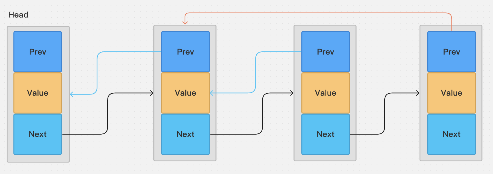

## 单链表



### 遍历

```python
class Node(object):
    def __init__(self, value, next_node=None):
        self.value = value
        self.next_node = next_node


def print_linked_list(root):
    while root:
        print(root.value)
        root = root.next_node


root = Node(0)
n1 = Node(1)
n2 = Node(2)
n3 = Node(3)

root.next_node = n1
n1.next_node = n2
n2.next_node = n3

print_linked_list(root)
```

### 删除倒数第K个数

`https://leetcode.cn/problems/remove-nth-node-from-end-of-list/`

> `快慢指针` (双指针法)

```python
# Definition for singly-linked list.
# class ListNode:
#     def __init__(self, x):
#         self.val = x
#         self.next = None

class Solution:
    def removeNthFromEnd(self, head: ListNode, n: int) -> ListNode:
        root = head
        first = second = head

        while n > 0:
            first = first.next
            n -= 1

        if not first:
            return root.next
            
        while first.next:
            first = first.next
            second = second.next

        second.next = second.next.next
        return root
```

`Go`

```go
/**
 * Definition for singly-linked list.
 * type ListNode struct {
 *     Val int
 *     Next *ListNode
 * }
 */
func removeNthFromEnd(head *ListNode, n int) *ListNode {
    dummy := &ListNode{Val: 0, Next: head}

    fast := dummy
    slow := dummy

    for i := 0; i < n + 1; i++ {
        fast = fast.Next
    }


    for {
          if fast == nil {
              if slow.Next != nil {
                    slow.Next = slow.Next.Next
              }
              break
          }

          fast = fast.Next
          slow = slow.Next
    }

    return dummy.Next
}
```

## 双链表



`Python`

```python
# Definition for double-linked list.
class Node:
    def __init__(self, val, next_node=None, prev=None):
        self.value = val
        self.prev = prev
        self.next_node = None


def print_linked_list(root):
    while root:
        print(root.value)
        root = root.next_node


def reverse_print_linked_list(node):
    while node:
        print(node.value)
        node = node.prev


root = Node(0)
n1 = Node(1, prev=root)
n2 = Node(2, prev=n1)
n3 = Node(3, prev=n2)

n1.next_node = n2
n2.next_node = n3

root.next_node = n1

print_linked_list(root)
print("reverse print")
reverse_print_linked_list(n3)
```

## 循环链表




`Python`

```python
# Definition for circular linked list.
class Node:

    def __init__(self, val, next_node=None, prev=None):
        self.value = val
        self.prev = prev
        self.next_node = None


root = Node(0)
n1 = Node(1, prev=root)
n2 = Node(2, prev=n1)
n3 = Node(3, prev=n2)


n1.next_node = n2
n2.next_node = n3

n3.next_node = n1

root.next_node = n1
```
