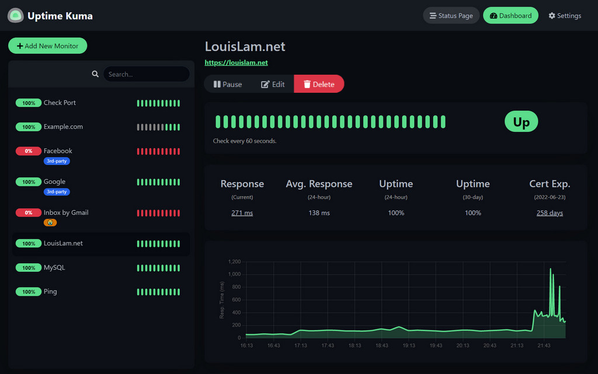

## 2023

### 2-24 Go

`Go`

- [MPG模型](/golang/mpg)
- [GC](/golang/gc)

### 2-23 Algo


`算法`

- [单链表](/algo/linked_list)
  - 删除倒数第K个节点 (快慢指针)

### 2-22 kuma


>  A fancy self-hosted monitoring tool

- Github: https://github.com/louislam/uptime-kuma
- Website: uptime.kuma.pet

```bash
# Run
docker run -d --restart=always -p 3001:3001 -v uptime-kuma:/app/data --name uptime-kuma louislam/uptime-kuma:1
```


